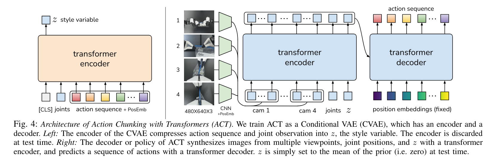
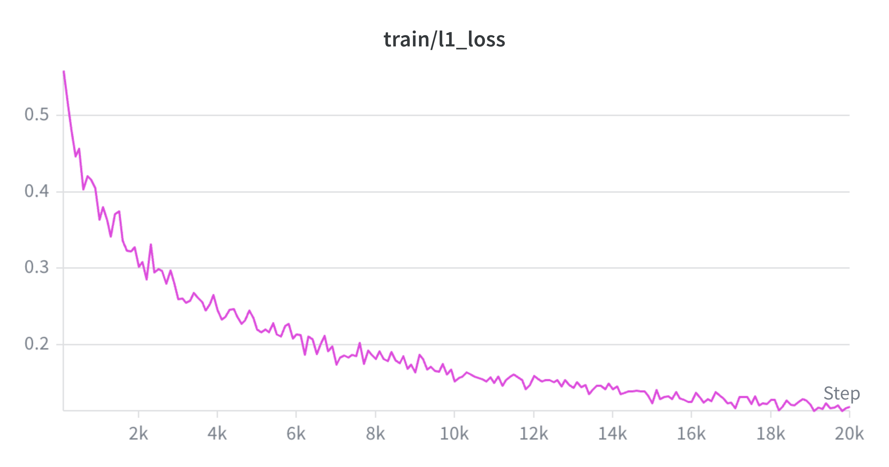
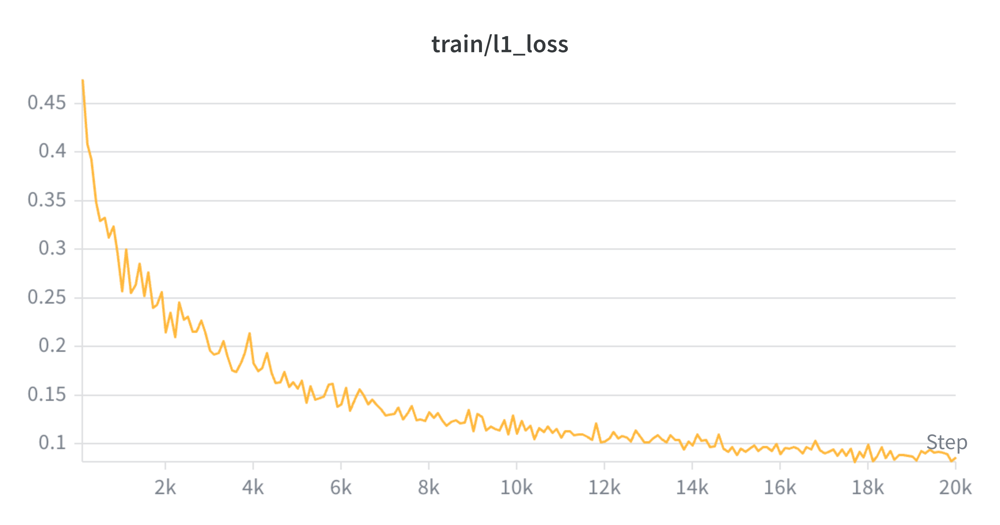
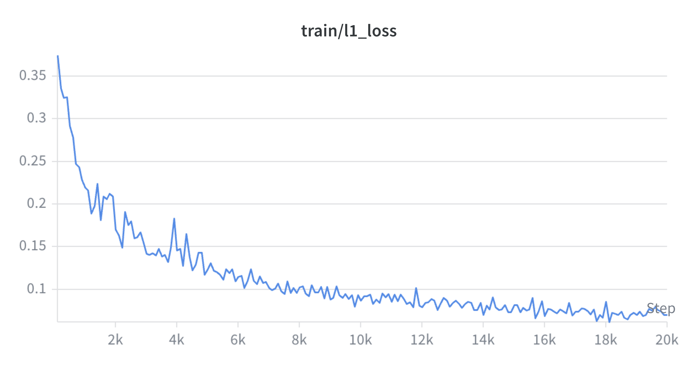

<style>
/* Center markdown tables. Cayman forces `display:block; width:100%`, so we
   shrink the table to its content width first, then auto-center it. */
.main-content table {
  display: table;
  width: auto;
  max-width: 100%;
  margin-left: auto;
  margin-right: auto;
}
/* Justify body paragraphs for even edges. Note: NO text-align-last — that
   stretches the final/single line into ugly word gaps. Last lines stay ragged. */
.main-content p {
  text-align: justify;
  hyphens: auto;
}
/* ...but leave paragraphs inside the flex cards left-aligned. */
.main-content div p {
  text-align: left;
}
</style>

*I varied one number in ACT's config from 16 to 100. Success collapsed from 14% to 0%. But the real finding wasn't the collapse — it was why. And it took seven dead ends and one falsified hypothesis to even run the experiment.*

---

## The setup

**The PushT task.** A circular block pushes a T-shaped block to a green target zone. At every timestep the environment gives a reward: 1.0 when the T perfectly covers the target, 0.0 when it's nowhere near. It's the simplest robot-learning task that surfaces real behavior — a single action dimension, a single objective, but enough physics to punish sloppy predictions.

<video autoplay loop muted playsinline width="100%" style="max-width:600px; border-radius:6px; display:block; margin:0 auto 1.5em;">
  <source src="assets/pushT-demo.mp4" type="video/mp4">
</video>

**What ACT does.** ACT (Action Chunking Transformer) is a visuomotor policy. It sees a camera image and the robot's joint positions, and predicts a *chunk* of future actions. `chunk_size` controls how many actions are predicted at once. `n_action_steps` controls how many of those predictions are executed open-loop before the policy re-observes the world and re-plans.



*Figure 2 from Zhao et al. (2023). The CVAE encoder compresses image + joint state into a latent style variable `z`; the decoder takes `z` + the same inputs and predicts an action chunk. All the knobs live in [`configuration_act.py`](https://github.com/huggingface/lerobot/blob/main/src/lerobot/policies/act/configuration_act.py).*

**The experiment.** Change `chunk_size`, keep everything else locked, and measure what happens to task success on PushT.

| Variable | chunk_size ∈ {16, 32, 100} |
|---|---|
| n_action_steps | matched to chunk_size (predict N → execute N → re-plan) |
| batch_size, seed, steps | 64, 1000, 20000 (locked) |
| Stack | `huggingface/lerobot-gpu`, torch 2.11, LeRobot 0.5.2, torchcodec-CPU |

**The metrics.** There are two that matter, and they disagree:

<div style="display:flex; gap:1.5em; margin:1.5em 0;">
  <div style="flex:1; background:#E3F2FD; border-radius:8px; padding:1.2em; border-left:4px solid #42A5F5;">
    <strong style="font-size:1.1em;">max_reward</strong>
    <p style="margin:0.5em 0; color:#555;">Per episode: the single best frame of T-block → goal overlap. <strong>1.0 = perfect coverage</strong>, even if only for an instant.</p>
    <p style="margin:0; font-size:0.9em; color:#777;">Example: Episode 37 — max_reward 0.999, pc_success false. The T grazed the goal perfectly for one frame, then drifted away.</p>
  </div>
  <div style="flex:1; background:#E8F5E9; border-radius:8px; padding:1.2em; border-left:4px solid #66BB6A;">
    <strong style="font-size:1.1em;">pc_success</strong>
    <p style="margin:0.5em 0; color:#555;">Per episode: did the block <strong>sustain</strong> coverage above the threshold long enough? Binary. Much stricter than max_reward ≈ 1.0.</p>
    <p style="margin:0; font-size:0.9em; color:#777;">Same episode 37: max_reward 0.999 but success = false. A one-frame graze doesn't count.</p>
  </div>
</div>

The gap between these two metrics is where the finding lives.

<div style="border-left:4px solid #EF5350; background:#FFEBEE; padding:1em 1.2em; margin:1.5em 0; border-radius:4px;">
  <strong>⚠️ The Confound</strong><br>
  Matching <code>n_action_steps = chunk_size</code> varies two things at once: (1) how far ahead the model learns to predict during training, and (2) how many actions are executed open-loop before re-planning during inference. A bigger <code>chunk_size</code> means the policy re-plans less often. This experiment measures the <em>combined</em> effect. Isolating them is a follow-up. Naming the confound is itself part of showing you understand what you're measuring.
</div>

---

## The results

<div style="display:flex; gap:0.8em; margin:1.5em 0; flex-wrap:wrap;">
  <figure style="flex:1; min-width:150px; margin:0; text-align:center;">
    
    <figcaption style="font-size:0.85em; color:#777; margin-top:0.3em;">chunk16 — L1 loss</figcaption>
  </figure>
  <figure style="flex:1; min-width:150px; margin:0; text-align:center;">
    
    <figcaption style="font-size:0.85em; color:#777; margin-top:0.3em;">chunk32 — L1 loss</figcaption>
  </figure>
  <figure style="flex:1; min-width:150px; margin:0; text-align:center;">
    
    <figcaption style="font-size:0.85em; color:#777; margin-top:0.3em;">chunk100 — L1 loss</figcaption>
  </figure>
</div>

*All three runs converged — the loss curves are stable by 20k steps. The result differences aren't an undertraining artifact (with the caveat that chunk100 may need more steps — see Analysis).*

| chunk_size | pc_success | avg_max_reward | avg_sum_reward |
|---|---|---|---|
| 16 | **14.0%** (7/50) | 0.686 | 71.29 |
| 32 | **8.0%** (4/50) | 0.706 | 79.15 |
| 100 | **0.0%** (0/50) | 0.326 | 28.28 |

`pc_success` drops monotonically: 14% → 8% → 0%. Bigger chunks, worse success. Straightforward.

But `avg_max_reward` doesn't follow the same curve. It *peaks* at chunk32: 0.706, higher than chunk16's 0.686. The model that succeeded less often came closer to the goal on average. At chunk32, `sum_reward` is also highest (79.15), meaning the block spent the most cumulative time near the goal. Then both metrics collapse at chunk100 (avg_max 0.326, sum 28.28) — the block never really got close.

**The chunk32 paradox.** Watching the evaluation videos makes this concrete. The block approaches the goal smoothly and accurately — more fluid than chunk16, fewer jittery corrections. It lands on the target. Then, executing the tail of its 32-action chunk open-loop, it pushes the T *away* before the next re-plan fires. By the time it re-observes, the drift has already happened. It corrects, gets back near the goal, overshoots again. The approach is better. The sustained coverage is worse.

At chunk100, the policy re-plans only ~3 times across a 300-step episode. It executes 100 actions blind. The block drifts. It never recovers. Zero successes — it barely reaches the goal at all.

---

## What it took to get here

This experiment is one command: `lerobot-train ... --policy.chunk_size=16`. It took seven dead ends and one falsified hypothesis before that command ran clean. Here are two that earned their spot in the write-up.

### #1: I tried to move decode to the GPU — and proved myself wrong

During the first successful run, the GPU sat at ~90% idle. `data_s` — the time spent fetching the next batch from the dataloader — was ~0.44 seconds per training step. `updt_s` — the time spent computing the gradient — was ~0.037 seconds. The GPU was waiting on the CPU 12× longer than it was computing.

The natural diagnosis: the CPU video decoder is the bottleneck. Move video decode to the GPU (NVDEC). Feed frames directly to the GPU. Eliminate the data stall.

So I benchmarked it. PushT video, RTX PRO 4000, 500 random-index seeks:

| Decoder | Random-access fps | DataLoader `data_s` (median) |
|---|---|---|
| pyav (CPU) | — | 24.5 ms |
| torchcodec (CPU) | 50 | 0.4 ms |
| torchcodec (CUDA/NVDEC) | **7** | — |

#### Why random access kills video decoders

<div style="display:flex; gap:1.5em; margin:1.5em 0;">
  <div style="flex:1; background:#E8F5E9; border-radius:8px; padding:1.2em; border-left:4px solid #66BB6A;">
    <strong>Sequential access</strong>
    <p style="margin:0.5em 0; color:#555;">Frames: <code>0 → 1 → 2 → 3 → 4 → …</code></p>
    <p style="margin:0.3em 0; color:#555;">Decoder reads one GOP (Group of Pictures), decodes once, feeds frames in order. This is what video decoders are optimized for.</p>
    <table style="width:100%; margin-top:0.8em; font-size:0.9em;">
      <tr><td>CPU</td><td><strong>2,284 fps</strong></td></tr>
      <tr><td>NVDEC</td><td><strong>2,599 fps</strong></td></tr>
    </table>
    <p style="margin:0.3em 0; font-size:0.8em; color:#888;">NVDEC wins slightly — streaming is its design target.</p>
  </div>
  <div style="flex:1; background:#FFEBEE; border-radius:8px; padding:1.2em; border-left:4px solid #EF5350;">
    <strong>Random access — the DataLoader</strong>
    <p style="margin:0.5em 0; color:#555;">Frames: <code>347, 12, 891, 45, 632, …</code></p>
    <p style="margin:0.3em 0; color:#555;">Shuffled dataset → each seek jumps to a different GOP. Decoder must: (1) find nearest keyframe before target, (2) decode forward through intermediates, (3) discard them.</p>
    <table style="width:100%; margin-top:0.8em; font-size:0.9em;">
      <tr><td>pyav (CPU)</td><td>~2 fps (est.)</td></tr>
      <tr><td>torchcodec (CPU)</td><td><strong>50 fps</strong></td></tr>
      <tr><td>NVDEC</td><td><strong>7 fps</strong></td></tr>
    </table>
    <p style="margin:0.3em 0; font-size:0.8em; color:#888;">NVDEC is 7× slower than CPU — per-seek GPU transfer overhead kills it.</p>
  </div>
</div>

Three things this table says:

1. **The bottleneck was seeking, not decoding.** CPU sequential decode does 2,284 fps. Random access drops to 50 fps — a ~45× penalty. The shuffled DataLoader asks for frames in arbitrary order. The cost is finding the right frame, not decoding it.

2. **torchcodec-CPU was 60× faster than pyav in the real dataloader** (0.4 ms vs 24.5 ms median). pyav seeks wastefully — it decodes from the last keyframe forward. torchcodec seeks frame-accurately. The fix was already the default; pyav was only in use because an earlier torchcodec mismatch had forced a fallback. Free.

3. **NVDEC was 7× slower than CPU at random access** (7 vs 50 fps). Per-seek overhead + per-frame GPU transfer kills it. NVDEC is built for streaming sequential frames, not seeking to random ones. The whole "move decode to GPU" hypothesis was wrong.

I'd built a mental model of the bottleneck, gathered the tools to fix it, and then measurement showed the premise was false. The fix wasn't a hardware upgrade or a day of NVDEC configuration. It was changing one word in a CLI flag: `pyav` → `torchcodec`. The GPU had been sitting 90% idle because the default backend was fine all along — I'd just never let it run.

*Measure the bottleneck before optimizing it.*

### #2: The tutorial didn't mention these four flags

The LeRobot README says:

```
lerobot-train --dataset.repo_id=lerobot/pusht --policy.type=act
```

Four flags it does not mention, each of which crashed training before the first step:

**`--policy.push_to_hub=false`.** LeRobot defaults to pushing the model to Hugging Face Hub at the end of training. No repo configured → crash. Invisible if you have a Hub token set.

**Check out a release tag, not `main`.** GR00T's policy config on `main` uses an older `@strict` API that's incompatible with the current `huggingface_hub`. One policy you won't use takes down the entire `lerobot-train` import. The fix: `git checkout $(git describe --tags $(git rev-list --tags --max-count=1))`.

**`--env_eval_freq=10000`, not `--eval_freq`.** LeRobot 0.5.2 renamed the sim-evaluation frequency flag. The old name errors with `unrecognized arguments`. The new name isn't in the 0.5.2 changelog.

**`--eval.n_episodes=50`, not less.** Eval instantiates parallel environments equal to `eval.batch_size` (default 50). `eval.n_episodes=30` → `ParsingError`. It refuses to create more envs than it uses.

Each is a one-line fix. Combined: four attempts before the training loop started. Tutorial commands assume the exact environment their author tested on — the same LeRobot commit, the same packages, the same flags. When any link in the chain is different, the command that "just works" doesn't.

---

## Analysis: what the numbers actually mean

**The open-loop staleness tax.** Every chunk_size increase, when `n_action_steps` is matched, reduces how often the policy re-observes the world. At chunk16 it re-plans ~19 times per 300-step episode. At chunk32: ~9 times. At chunk100: ~3 times. With fewer re-plans, drift from the stale prediction accumulates longer before correction. The tax grows faster than any benefit from a longer training horizon.

This explains the chunk32 paradox directly. chunk32's approach trajectories are smoother (longer horizon = more coherent multi-step predictions). The block reaches the goal more accurately on average — hence the higher avg_max_reward (0.706). But the matched `n_action_steps=32` means it commits to 32 actions blind. Near the goal, those tail-end actions push the block past the target before the next re-plan catches it. The approach is better; the sustained coverage is worse. chunk16 is twitchier but corrects faster.

**The fixed-budget caveat.** 20,000 training steps may under-serve chunk100. Longer action chunks are a harder prediction target — the model has to forecast further into the future — so it may simply need more steps to converge. The 0% success rate could be part open-loop staleness, part undertraining. A follow-up extending chunk100 to 40k+ steps would test this.

**The single-seed answer.** All three runs share seed=1000. The 14% → 8% → 0% direction is unambiguous — you don't need statistics to see that chunk100 is worse than chunk16. But the exact percentages have seed noise. A multi-seed follow-up would tighten the confidence intervals.

---

## What I'd do next

**Isolate horizon from re-plan frequency.** Fix `n_action_steps=16` and vary `chunk_size` independently (16, 32, 100). This separates "how far ahead does the model learn to predict?" from "how often does it re-observe during inference?" If success still drops with bigger `chunk_size` even at fixed re-plan rate, the training horizon itself is the limiting factor — not the staleness.

**Test whether chunk100 is undertrained.** Extend chunk100 to 40k+ steps. If success rises, the 0% was a budget effect, not a horizon ceiling. If it stays at 0%, the open-loop staleness at matched `n_action_steps=100` is fundamentally fatal.

**Multi-seed.** Three seeds per chunk_size to bound the variance.

---

## Reproduce

Everything needed to reproduce this experiment is in the [repository root](../):

- **Setup:** `lerobot-setup.sh` — one-time pod configuration
- **Train:** `scripts/train.sh <chunk_size>` — launches training with the locked config
- **Eval:** `scripts/eval.sh <chunk_size>` — standalone evaluation on saved checkpoint
- **Configs:** `configs/chunk{16,32,100}.yaml` — per-run locked configuration
- **Results:** `results/chunk{16,32,100}_eval.json` — per-episode eval data

**Environment:** `huggingface/lerobot-gpu@sha256:b0318f57aaab7d8204f5bd3c61bf98b4660c4240b546e60d6205e1d65035b9d2`, torch 2.11, LeRobot 0.5.2, torchcodec 0.11.1+cpu, seed=1000, PushT, 20k steps.